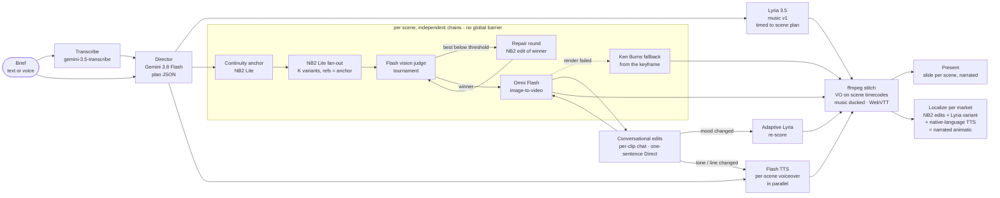

# AdLoop

**Brief → storyboard → film → score, in one loop.**

AdLoop is a GenMedia ad studio that turns a one-line brief (typed or spoken) into a finished, scored,
localized, **narrated** video ad — and then lets you *direct* it in plain English. Three focus models do the
heavy lifting (**Nano Banana 2 Lite** storyboards, **Gemini Omni Flash** motion, **Lyria 3.5** score), with Gemini
3.8 Flash directing and judging and Gemini Flash TTS voicing the ad scene by scene, all in one pipelined,
high-throughput loop where speed and cross-modal continuity carry the product, not just the demo.

> Kaggle GDM Hyderabad Hackathon · **Problem Statement 3** · Nano Banana 2 Lite · Gemini Omni Flash · Lyria 3.5

---

## Why it clears the PS3 bar

- **A chain, not a prompt box.** Every model's output is the next model's input: the plan conditions the
  storyboard, the judge picks keyframes, keyframes become Omni clips, scene moods become Lyria's timed score,
  each scene's voiceover line becomes narration placed on that scene's timecode, and edits flow back through all of them.
- **Throughput matters.** A 4-scene ad with 4 variants per scene is 16+ Nano Banana 2 Lite generations,
  4+ judge calls, 4 Omni renders and a score. AdLoop runs them as **independent per-scene chains with no global
  barrier**: scene 1 can be rendering video while scene 4 is still being judged.
- **Speed buys quality.** NB2 Lite's latency lets us generate four candidates, keep one and discard three —
  a judge tournament with a self-repair round, which a slow image model can't afford to run.
- **Continuity is designed in.** A continuity anchor frame is passed to every NB2 call, winners are animated from
  their exact keyframe, the soundtrack is timed to the planned scene durations, and each narration line is placed at
  its scene's start with the music ducked underneath.
- **Speed is visible.** Every tile shows its latency; a live telemetry drawer shows p50/p95, images/min,
  in-flight work per modality, time-to-first-image, time-to-first-clip and time-to-final.

---

## Architecture



**Latency hiding.** Music v1 and every scene's voiceover start the moment the plan exists, in parallel with the
anchor — the plan already contains durations, moods and narration lines. Each scene's Omni render is submitted the
instant that scene's winner is known. The final cut is stitched automatically once every clip, the score and the
voiceovers have a version, and re-stitched (debounced) after any later change.

**The cut always completes.** A failed voiceover is simply left out of the mix, and a failed Omni render falls back
to a Ken Burns move over the winning keyframe, so one bad call never blocks the film.

**Event sourcing.** Every state change is an event, streamed to the browser over SSE and appended to
`data/runs/<id>/events.jsonl`. The UI is rebuilt from `GET /api/runs/{id}` plus the event stream, so refreshes,
reconnects and full **replays** of past runs all fall out of the same mechanism.

---

## Which model does what, and why

| Role | Model (env var) | Why this model |
|---|---|---|
| Creative director, vision judge, edit interpreter *(supporting)* | `gemini-3.8-flash` (`ADLOOP_MODEL_TEXT`) | Fast structured JSON with vision; plans the campaign, scores variants against a 5-axis rubric, turns plain-English direction into per-modality edit plans. |
| Storyboard, repairs, localization | **Nano Banana 2 Lite** `gemini-3.1-flash-lite-image` (`ADLOOP_MODEL_IMAGE`) | The throughput engine. Low latency makes K-variant tournaments and N-market localization fan-outs affordable; reference images keep hero and product consistent. |
| Image-to-video, conversational video edits | **Gemini Omni Flash** `gemini-omni-1.1-flash` (`ADLOOP_MODEL_VIDEO`) | Animates the exact winning keyframe; multi-turn edits through the Interactions API (`previous_interaction_id`) keep context across "slower push-in" → "now add rain". |
| Soundtrack | **Lyria 3.5** `lyria-3.5` (`ADLOOP_MODEL_MUSIC`) | Timed prompts built from scene durations and moods; re-scored automatically when edits change a scene's mood; ducked under the narration at stitch time. |
| Scene-by-scene voiceover *(supporting)* | `gemini-3.8-flash-tts` (`ADLOOP_MODEL_TTS`) | Voices each scene's line (hook → benefit → CTA) in the plan's chosen voice and style; re-voices on tone changes; speaks localized lines in each market's language. |
| Voice brief *(supporting)* | `gemini-3.5-transcribe` (`ADLOOP_MODEL_TRANSCRIBE`) | Speak the brief or the direction instead of typing it. |

All model access goes through one adapter, `app/genai_client.py` (`GenMedia`). Each method tries the primary API
path (Interactions API), falls back automatically (`generate_content`, `generate_videos`, minimal request on
HTTP 400), **remembers which path worked per model**, retries 429/5xx with exponential backoff, and caps
concurrency per modality.

---

## Features

- **Brief panel** — text or voice brief, brand name, optional product photo (becomes a continuity reference),
  16:9 / 9:16, 3–6 scenes × 2–6 variants, sample briefs.
- **Live pipeline rail** — Director → Storyboard → Judge → Motion → Score → Final cut, with per-stage timings.
- **Storyboard fan-out** — tiles stream in as they land, each with its latency; judge scores, winner crown,
  rationale and repair-round tiles; click any tile to override the winner, or regenerate a scene with an instruction.
- **Motion lab** — one clip per scene with live render status, version history (v1, v2, …) and a per-clip chat
  ("golden hour light", "orbit the product") backed by Omni multi-turn editing. Each card also shows the scene's
  voiceover line: edit the text, preview it, and "↻ re-voice" just that scene.
- **Direct the whole ad** — one sentence ("make it a monsoon evening", "make it playful") fans out to every clip
  edit, a music re-score and any re-voiced lines in parallel.
- **Narrated voiceover** — a mini-story told across the scenes (hook → desire → product benefits → brand + CTA),
  word-budgeted to each scene's length, placed on its timecode (sped up ≤ 1.2× if it runs long), with the music
  sidechain-ducked underneath and WebVTT captions on the final player.
- **Adaptive soundtrack** — Lyria score with a version list explaining each re-score ("scene s2 → moody").
- **Final cut + presentation mode** — stitched MP4 with captions and download, and a fullscreen, **slide-by-slide
  narrated** pitch: title → one slide per scene (clip looping full-bleed, its voiceover playing, the line as a big
  caption) → the full film → "how it was made" stats → localized animatics. Auto-play advances when each line ends.
- **Localization** — per market: NB2 edits of every winning keyframe (translated on-image text, cultural
  adaptation, same composition), a regional Lyria variant, voiceover lines spoken in the market's language, and a
  **narrated, captioned animatic MP4** built from the localized keyframes.
- **Telemetry drawer** — throughput, p50/p95, in-flight bars per modality (incl. TTS), time-to-first-X,
  colour-coded event log. Closed by default; a live activity dot on its toggle shows when work is in flight.
- **Mock mode + replay** — the full app runs offline with synthetic assets; any finished run can be replayed from
  its event log.

---

## Quickstart

```bash
git clone <this repo> adloop && cd adloop
python3.11 -m venv .venv
.venv/bin/pip install -r requirements.txt
cp .env.example .env          # then set GEMINI_API_KEY=... in .env
.venv/bin/uvicorn app.main:app --port 8000 --reload
# open http://localhost:8000
```

**Mock mode** (no key, no network, synthetic assets): leave `GEMINI_API_KEY` empty or run with `ADLOOP_MOCK=1`:

```bash
ADLOOP_MOCK=1 .venv/bin/uvicorn app.main:app --port 8000
```

**Local dev.** The top bar shows a **● LIVE** / **● MOCK** badge (from `/api/health`), so you always know whether
real models are being called. Mock mode keeps every feature working — synthetic keyframes, Ken Burns clips,
chord-progression music and speech-like voiceover audio — and `ADLOOP_MOCK_SPEED` (e.g. `0.3`) scales the simulated
latencies. The end-to-end check runs fully in-process (no port, no network):

```bash
.venv/bin/python scripts/e2e_mock.py --inprocess --data-dir /tmp/adloop_e2e --mock-speed 0.3
```

ffmpeg: a system `ffmpeg` on `PATH` is used when present; otherwise the binary bundled with `imageio-ffmpeg`.

**Check the models before a demo:**

```bash
.venv/bin/python scripts/smoke_test.py                  # live probe of every model in pipeline order
.venv/bin/python scripts/smoke_test.py --raw --only video   # bypass the adapter, print raw SDK responses
.venv/bin/python scripts/bench_nb2.py -n 32 -c 16 --ref     # NB2 burst benchmark -> data/bench/*.csv
```

All configuration is via environment variables, documented in [`.env.example`](.env.example). The ones added for
narration:

| Variable | Default | Purpose |
|---|---|---|
| `ADLOOP_MODEL_TTS` | `gemini-3.8-flash-tts` | voiceover model id |
| `ADLOOP_TTS_CONCURRENCY` | `6` | max in-flight TTS calls (per-modality semaphore) |
| `ADLOOP_TTS_PATH` | *(auto)* | pin the TTS API path (`generate_content` or `interactions`) to skip probing |

---

## API reference

| Method | Path | Body | Returns |
|---|---|---|---|
| GET | `/` | – | studio UI (`static/` mounted at `/static`) |
| GET | `/api/health` | – | `{ok, mode, models, ffmpeg, genai}` (per-model calls, errors, working API path, p50/p95) |
| POST | `/api/transcribe` | multipart `audio` | `{text, latency_ms, model, api_path}` |
| POST | `/api/runs` | multipart `brief`, `brand`, `aspect`, `n_scenes`, `variants`, `markets`, `product_image` | `{run_id}` · 429 if rate-limited |
| GET | `/api/runs` | – | recent runs (max 20, newest first) |
| GET | `/api/runs/{id}` | – | full run state JSON |
| GET | `/api/runs/{id}/events` | `?replay=1&speed=4` | SSE: history, then live; `replay=1` re-paces a finished run |
| POST | `/api/runs/{id}/scenes/{sid}/select` | `{idx}` | override the judge's winner → re-render clip |
| POST | `/api/runs/{id}/scenes/{sid}/regenerate` | `{instruction?}` | new NB2 round → judge → clip |
| POST | `/api/runs/{id}/scenes/{sid}/edit` | `{instruction}` | Omni conversational edit (+ adaptive re-score) |
| POST | `/api/runs/{id}/scenes/{sid}/voiceover` | `{text?, voice?}` | re-voice that scene (new line and/or voice) → re-stitch |
| POST | `/api/runs/{id}/direct` | `{instruction}` | one sentence → every modality (clips, score, voiceover) |
| POST | `/api/runs/{id}/music` | `{instruction?}` | re-score |
| POST | `/api/runs/{id}/localize` | `{markets: [...]}` | per-market keyframes, score, native-language voiceover and narrated animatic |
| POST | `/api/runs/{id}/final` | – | force re-stitch |
| GET | `/api/showcase` | – | `{run_id}` for "Watch sample run" |
| GET | `/media/{run_id}/{file}` | – | generated asset |

All mutating endpoints return `{"ok": true}` immediately; progress arrives on the event stream. Errors are
`{"error": "..."}` with a proper status code.

## Event stream

Every event carries `type`, `run_id` and `t` (ms since run start).

| Type | Payload |
|---|---|
| `run_started` | `mode, input` |
| `stage` | `stage` (director/anchor/storyboard/judge/motion/music/voiceover/final/localize/direct), `status` (start/done/error), `scene_id?`, `ms?`, `detail?` |
| `transcript` | `text` |
| `plan` | `plan` |
| `anchor` | `url, latency_ms` |
| `variant` / `variant_error` | `scene_id, idx, round, url, latency_ms, api_path` / `…, error` |
| `judge` | `scene_id, round, scores[], winner_idx, rationale, fix_instructions, latency_ms` |
| `winner` | `scene_id, idx, url, by` (judge/user) |
| `clip_status` / `clip` | `scene_id, status, elapsed_ms?, error?` / `scene_id, v, url, instruction, latency_ms, api_path, interaction_id, fallback` |
| `scene_update` | `scene_id, mood, energy` |
| `voiceover_status` / `voiceover` | `scene_id, status, error?` / `scene_id, v, text, url, latency_ms, duration_s` |
| `music_status` / `music` | `status, reason?, error?` / `v, url, prompt, latency_ms, reason` |
| `final_status` / `final` | `status, error?` / `url, duration_s, version, captions_url` |
| `direction` | `instruction, summary, plan` |
| `localize_status` / `localize_plan` / `localize_image` / `localize_music` | per-market progress and assets |
| `localize_voiceover` | `market, scene_id, url, text, latency_ms` |
| `localize_video` | `market, url, duration_s, captions_url` (the narrated animatic) |
| `metrics` | throughput, latency percentiles, in-flight counts (incl. `tts`), `voiceovers_generated`, `tts_p50_ms`, time-to-first-X, working API paths |
| `log` / `error` | `level, msg` / `stage, msg` |
| `run_done` | `wall_ms` (first final cut) |

---

## Project layout

```
app/
  config.py        settings from env (models, concurrency, limits, paths, mock switch)
  genai_client.py  GenMedia: the only module that talks to Google; adaptive fallbacks + path memory
  prompts.py       director / judge / direction / localization / voiceover prompts and schemas
  mock.py          deterministic offline plans, judgements and edit plans
  pipeline.py      pipelined per-scene scheduler, user actions, auto re-stitch
  events.py        event bus: SSE fan-out + events.jsonl persistence + replay
  media.py         ffmpeg helpers: Ken Burns, normalize, crossfade, music fit, VO placement + ducking, WebVTT, stitch
  main.py          FastAPI app, HTTP API, rate limiting, static + media serving
static/            vanilla-JS studio UI (index.html, app.js, styles.css) — no build step
scripts/
  smoke_test.py    live probe of every model (GenMedia or --raw SDK), table + artefacts
  e2e_mock.py      end-to-end mock-mode check (in-process ASGI or a running server)
  bench_nb2.py     NB2 Lite burst benchmark -> CSV
deploy/            HF Spaces README, Render blueprint, HF push helper, DEPLOY.md
data/runs/<id>/    run.json, events.jsonl and every generated asset (gitignored)
```

## Deploy

One Docker image for Hugging Face Spaces, Google Cloud Run and Render — step-by-step in
[`deploy/DEPLOY.md`](deploy/DEPLOY.md), including secrets handling and a demo-hardening checklist
(per-IP rate limits, concurrent-run cap, mock fallback, showcase replay).

---

## Measured performance

Numbers from `scripts/bench_nb2.py` and the telemetry of a live 4-scene × 4-variant run.

| Metric | Value |
|---|---|
| NB2 Lite latency p50 / p95 (burst of [[N]], concurrency [[C]]) | [[NB2 p50]] / [[NB2 p95]] |
| NB2 Lite throughput | [[images/min]] images/min |
| Time to first storyboard image | [[TTFI]] |
| Time to first Omni clip | [[TTFC]] |
| Time to first final cut (4 scenes, 16 variants + repairs, 4 clips, score) | [[time-to-final]] |
| Omni conversational edit round-trip | [[edit latency]] |
| Lyria score (v1) latency | [[music latency]] |
| Flash TTS per-scene voiceover p50 | [[TTS p50]] |

---

## Limitations & next steps

- **Single-instance state.** Runs live on local disk and in memory; horizontal scaling needs an object store and a
  shared event log (the event-sourced design makes that a storage swap, not a rewrite).
- **Preview APIs.** Model ids and request shapes are previews; the adapter falls back automatically, but new
  capabilities (e.g. native video extend) aren't exploited yet.
- **Judge = one model.** The tournament uses a single Flash judge; ensembles or pairwise comparisons would reduce
  judge variance.
- **Localized video is an animatic.** Markets get narrated Ken Burns animatics of the localized keyframes, not new
  Omni renders (a cost/latency choice; the same pipeline could fan out Omni per market).
- **Narration is timed, not lip-synced.** Lines are placed per scene and time-stretched ≤ 1.2×; on-screen talent
  doesn't speak them.
- **Next:** brand-kit memory across campaigns, A/B export of variants to ad platforms, lip-synced talent, and
  learning the judge rubric from user overrides.
